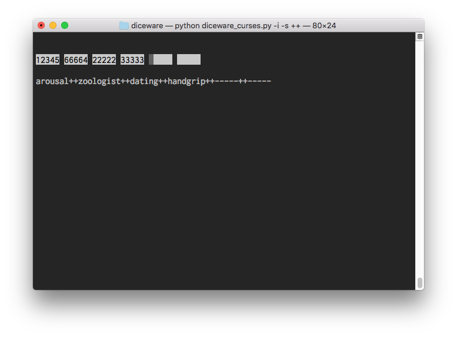

# Diceware-Curses
### CLI Utility to translate physical dice rolls to words with the [EFF's large word list](https://www.eff.org/deeplinks/2016/07/new-wordlists-random-passphrases).

Use the diceware method to generate passwords, no Ctrl-F required!

This utility makes no network requests. It's totally local. It takes 5-digit numbers and an optional spearator, and creates a passphrase!

## CLI Usage
```
$ pipenv run python diceware_curses.py -s ++ 12345 66664 22222 33333
arousal++zoologist++dating++handgrip
```

## Interactive Usage
```
$ pipenv run python diceware_curses.py -i
```


Press `q`, and passphrase written to stdout on quitting
```
arousal++zoologist++dating++handgrip++-----++-----
```